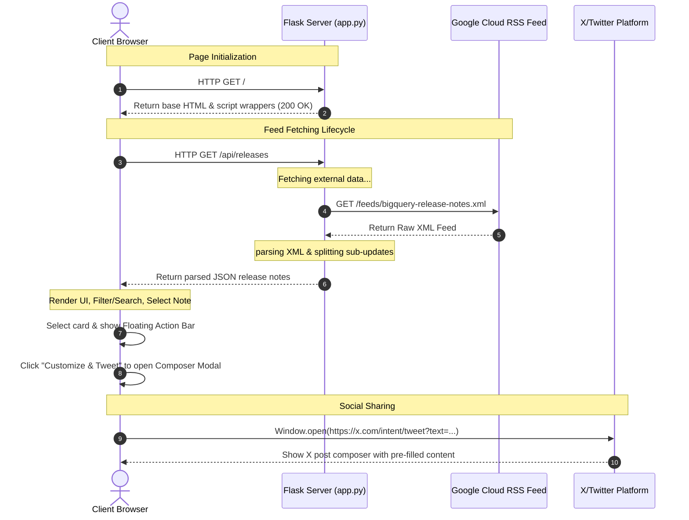

# BigQuery Release Notes Dashboard & sharing App

A web application built using a Python Flask backend and a plain vanilla HTML, JavaScript, and CSS frontend. The application fetches, parses, and segments the BigQuery Release Notes RSS Atom feed from Google Cloud, providing an interactive dark-themed dashboard to browse, filter, search, and tweet about specific updates.

---

## 🚀 Setup & Execution Instructions

### Prerequisites
* Python 3.8+ installed on your system.

### 1. Clone & Navigate
Navigate to the project root directory:
```bash
cd bq-releases-notes
```

### 2. Environment Setup
Create and activate a virtual environment to isolate project dependencies:

**Windows (PowerShell):**
```powershell
python -m venv venv
.\venv\Scripts\Activate.ps1
```

**Linux / macOS:**
```bash
python3 -m venv venv
source venv/bin/activate
```

### 3. Install Dependencies
Install the required Python packages (Flask and requests):
```bash
pip install Flask requests
```

### 4. Run the Server
Launch the Flask development server locally:
```bash
python app.py
```
By default, the application runs on **http://127.0.0.1:5000**. Open this link in your web browser.

---

## 📁 File Structure
* **[app.py](file:///C:/Users/STUDENT/Documents/Agentic_AI/agy-cli-projects/bq-releases-notes/app.py)**: The main backend entry point. Fetches the Atom RSS feed, segments updates, and hosts the JSON API.
* **[templates/index.html](file:///C:/Users/STUDENT/Documents/Agentic_AI/agy-cli-projects/bq-releases-notes/templates/index.html)**: The dashboard layout, search interface, modal composers, and action bars.
* **[static/css/style.css](file:///C:/Users/STUDENT/Documents/Agentic_AI/agy-cli-projects/bq-releases-notes/static/css/style.css)**: obsidian dark theme, glassmorphic layout tokens, custom check animations, and status highlights.
* **[static/js/app.js](file:///C:/Users/STUDENT/Documents/Agentic_AI/agy-cli-projects/bq-releases-notes/static/js/app.js)**: Front-end rendering engine. Handles API fetch, state tracking, searching, filtering, and Twitter limits.
* **[.gitignore](file:///C:/Users/STUDENT/Documents/Agentic_AI/agy-cli-projects/bq-releases-notes/.gitignore)**: Standard rules ignoring compilation, environment, and venv files.

---

# Project Architecture: BigQuery Release Notes Dashboard

This document provides a detailed breakdown of the BigQuery Release Notes Dashboard. It details the main features, server-side vs. client-side execution, and demonstrates a request-response lifecycle with a Mermaid flow diagram.

---

## 1. Key Features

- **Automated RSS Parsing**: Real-time extraction of XML feeds from Google Cloud, mapping atom nodes into structured JSON data.
- **Granular Segmentation**: Splitting a single calendar date's entry into its individual sub-updates (e.g. distinguishing a `Feature` from an `Issue` on the same day).
- **Responsive Obsidian Dashboard**: Sleek, glassmorphic client-side layout utilizing tailored neon coloring for distinct update statuses (`Feature`, `Announcement`, `Issue`, `Change`, `Breaking`).
- **Interactive Search & Filter**: Real-time matching of text patterns and instant classification of category chips.
- **X / Twitter Share Optimization**: A smart composer counting character constraints (treating the source URL as exactly 23 characters matching Twitter's `t.co` policies) along with a responsive radial progress indicator.

---

## 2. Server-side vs. Client-side Breakdown

### Server-Side ([app.py](file:///C:/Users/STUDENT/Documents/Agentic_AI/agy-cli-projects/bq-releases-notes/app.py))
The backend server runs on a Python Flask framework and is responsible for data acquisition and transformation:

* **Entry point (`/`)**: Renders the base HTML shell [index.html](file:///C:/Users/STUDENT/Documents/Agentic_AI/agy-cli-projects/bq-releases-notes/templates/index.html).
* **XML Fetching**: Leverages `requests` inside [get_releases](file:///C:/Users/STUDENT/Documents/Agentic_AI/agy-cli-projects/bq-releases-notes/app.py#L36) to request the raw XML feed from Google Cloud.
* **Feed Segmentation**: Uses regex rules in [parse_entry_content](file:///C:/Users/STUDENT/Documents/Agentic_AI/agy-cli-projects/bq-releases-notes/app.py#L9) to parse the CDATA HTML markup. It matches `<h3>` titles and isolates consecutive HTML block elements into discrete updates:
  ```json
  {
    "type": "Feature",
    "html": "<p>You can enable autonomous embedding...</p>"
  }
  ```

### Client-Side ([templates/index.html](file:///C:/Users/STUDENT/Documents/Agentic_AI/agy-cli-projects/bq-releases-notes/templates/index.html) & [app.js](file:///C:/Users/STUDENT/Documents/Agentic_AI/agy-cli-projects/bq-releases-notes/static/js/app.js))
The client side handles data rendering, interactive states, styling, and external integrations:

* **Presentation Layer**: [style.css](file:///C:/Users/STUDENT/Documents/Agentic_AI/agy-cli-projects/bq-releases-notes/static/css/style.css) handles transitions, glassmorphic gradients, dynamic card resizing, and styling for standard markdown/HTML elements inside the updates.
* **Interactive Timeline**: Instantiates the cards and populates stats charts dynamically.
* **Character Logic**: Standardizes Twitter's character validation constraints using [countTwitterCharacters](file:///C:/Users/STUDENT/Documents/Agentic_AI/agy-cli-projects/bq-releases-notes/static/js/app.js#L279) and computes initial prefilled text inside [generatePrefilledTweet](file:///C:/Users/STUDENT/Documents/Agentic_AI/agy-cli-projects/bq-releases-notes/static/js/app.js#L261).
* **Social Share Intent**: Employs X's native Web Intent interface `https://x.com/intent/tweet?text=...` to spawn sharing compositions out-of-app.

---

## 3. Request-Response Flow Diagram

The diagram below details the operational sequence from the initial page load to fetching the XML feed and sharing an update on X (Twitter).


